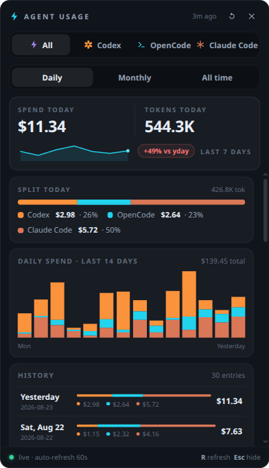
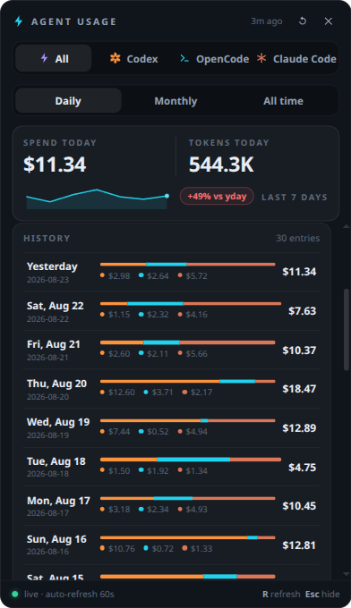
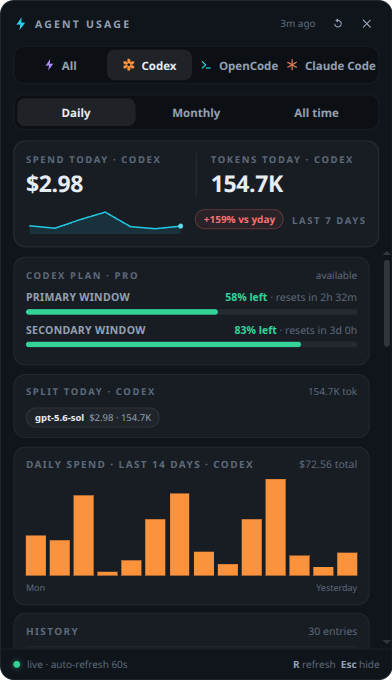

# Agent Usage — menubar tray for Linux (GNOME Wayland/X11)

A lightweight GNOME top-bar tray that shows LLM token usage and spend per agent harness — **Codex**, **OpenCode**, and **Claude Code** — in one place. Shells out to [`ccusage`](https://ccusage.com) every 60s, aggregates by day/month/all-time, and surfaces Codex plan quota (`wham/usage`).

Built for developers running multiple AI harnesses who want an at-a-glance cost/token meter.

<p align="center">
  
  
  
</p>

## Features

- Tray icon + live context menu (today / month / all-time, per-harness `◆ Codex` / `● OpenCode` / `✳ Claude Code`)
- Popup dashboard: Daily / Monthly / All-time tabs, 14-day stacked chart, per-harness cards with model breakdowns
- Codex quota window (remaining % + reset timer) via `~/.codex/auth.json`
- Auto-refresh 60s, `R` to refresh, `Esc` to hide

## Requirements

- **Linux + GNOME** with AppIndicator (`sudo apt install gnome-shell-extension-appindicator` if tray missing)
- **Node.js ≥ 18** (`curl -fsSL https://deb.nodesource.com/setup_20.x | sudo -E bash - && sudo apt install nodejs`)
- **bun** or **npm** (bun preferred)
- **Python 3 + Pillow** for icons (`sudo apt install python3 python3-pip && pip install Pillow` — installer handles it)

> **ccusage is bundled** as a regular npm dependency and runs on Electron's own Node runtime (`ELECTRON_RUN_AS_NODE`) — no global install, PATH entry, or system Node needed. Set `CCUSAGE_BIN` to override with an external binary.

> Electron pinned to **v42** — v43+ broke GNOME SNI tray (electron#52674).

## Install

```bash
git clone https://github.com/aniketsaurav18/agent-menubar.git
cd agent-menubar
./install.sh
```

User-local by default (no sudo). The installer checks deps, runs `bun install`/`npm install`, regenerates the flat violet robot icon (`assets/icon.png` via `scripts/gen-icons.py`), ensures `ccusage`, and creates:

- `~/.local/share/applications/agent-menubar.desktop`
- `~/.config/autostart/agent-menubar.desktop`
- `~/.local/bin/agent-menubar` shim

```bash
./install.sh --help        # all options
./install.sh --systemd     # also enable systemd --user service
./install.sh --no-autostart
sudo ./install.sh --system # system-wide (/opt/agent-menubar)
./install.sh --uninstall   # remove entries / service / shim
```

Launch: `agent-menubar`, `npm start`, or search **Agent Usage** in GNOME overview. Logs at `/tmp/opencode/agent-menubar.log` (or `journalctl --user -u agent-menubar.service -f` with `--systemd`).

## Uninstall

```bash
./install.sh --uninstall
sudo ./install.sh --system --uninstall  # if installed with --system
```

## Layout

```
src/main.js            tray, window, ccusage polling, IPC
src/preload.js         contextBridge
src/renderer/          dashboard UI (no build step)
scripts/gen-icons.py   regenerates assets/icon.png
install.sh             installer
```

MIT
